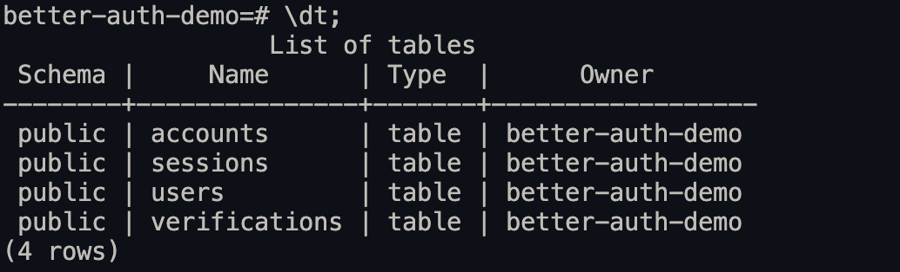

# Better Auth Demo

[Demo](https://nextjs.better-auth-starter.com)

## Run
1. Start the database
```bash
docker compose up -d
```
2. Create env
```bash
cp .env.example .env
```
3. Install dependencies
```bash
bun install
```
4. Generate schema and perform migrations
```bash
bunx --bun @better-auth/cli generate # re-generate schema based on the current auth configuration
bunx --bun drizzle-kit generate # generate migrations based on the current schema
bunx --bun drizzle-kit migrate # perform migrations
```
5. Run the development server
```bash
bun run dev
```

Open [http://localhost:3000](http://localhost:3000) with your browser to see the result.

## Database Inspection
Individual table schemas: [link](https://www.better-auth.com/docs/concepts/database#core-schema)



